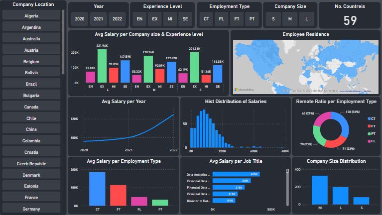

# Salaries-Dashboard



A Power BI dashboard for analyzing and visualizing salary data trends and insights. This project provides an interactive and user-friendly interface to explore salary distributions, trends, and key metrics.

## Features

- **Interactive Visualizations**: Dive into detailed visualizations, including charts and graphs for salary distribution, trends over time, and segmentation by various factors.
- **Customizable Filters**: Easily filter data by categories like job title, department, region, and more.
- **Dynamic Insights**: Gain actionable insights into salary trends to assist in decision-making.
- **User-Friendly Interface**: Simple and intuitive design to make data exploration seamless.

## Getting Started

### Prerequisites

To view and interact with the dashboard, ensure you have the following installed on your machine:

- [Power BI Desktop](https://powerbi.microsoft.com/desktop/)

### Installation

1. Clone this repository to your local machine:
   ```bash
   git clone https://github.com/Monzer-Hw/Salaries-Dashboard.git
   ```
2. Open the `dashboard.pbix` file in Power BI Desktop.

## Usage

1. Launch Power BI Desktop.
2. Open the `dashboard.pbix` file.
3. Interact with the dashboard by using filters and exploring visualizations.